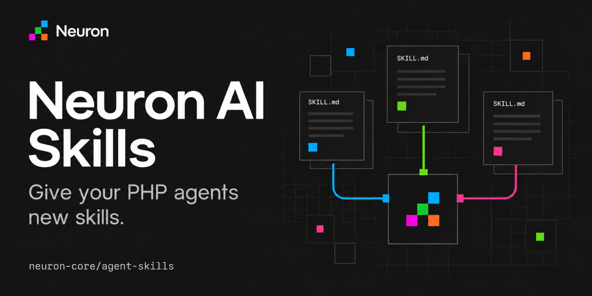

# Neuron AI Skills

[](https://github.com/neuron-core/agent-skills/actions/workflows/tests.yml)
[](composer.json)
[](LICENSE)

> [!IMPORTANT]
> Get early access to new features, exclusive tutorials, and expert tips for building AI agents in PHP. Join a community of PHP developers pioneering the future of AI development.
> [Subscribe to the newsletter](https://neuron-ai.dev)

> Before moving on, support the Neuron AI community giving a GitHub star ⭐️. Thank you!

Add Agent Skills to your [Neuron AI](https://github.com/neuron-core/neuron-ai)
agents with `SkillToolkit`. Combine your own skills with community packages and
make them available to the agent through a single toolkit.

The library handles skill discovery and provides tools for loading instructions
and supporting resources when needed. It follows the open
[Agent Skills specification](https://agentskills.io/specification) and supports
local directories as well as custom storage.



## Installation

Requires PHP 8.1+.

| Agent Skills | Neuron AI |
| --- | --- |
| 1.x (current) | 4.x |
| 0.x | 3.x |

```sh
composer require neuron-core/agent-skills
```

## Quick Start

Find community skills on [skills.sh](https://skills.sh) and install one from
your application's root:

```sh
npx skills add juliusbrussee/caveman --skill caveman --agent universal --yes
```

The [Skills CLI](https://github.com/vercel-labs/skills) requires Node.js/npm and
installs `caveman` into `.agents/skills`. Create an agent and register that
directory, replacing `your-api-key` with your OpenAI API key:

```php
use NeuronAI\Agent\Agent;
use NeuronAI\Chat\Messages\UserMessage;
use NeuronAI\Providers\OpenAI\OpenAI;
use NeuronAI\AgentSkills\Storage\FileSystemSkillStorage;
use NeuronAI\AgentSkills\Tools\SkillToolkit;

$toolkit = SkillToolkit::make()
    ->fromStorage(new FileSystemSkillStorage(__DIR__.'/.agents/skills'));

$agent = Agent::make()
    ->setThreadId('quick-start')
    ->setAiProvider(new OpenAI(key: 'your-api-key', model: 'gpt-5.4-nano'))
    ->addTool($toolkit);

$response = $agent->chat(new UserMessage(
    'Use caveman skill to explain how the universe works.',
));

echo $response->getMessage()->getContent();

// Actual response (excerpt):
// Cosmic history: big bang expansion. Early hot plasma cooled; atoms formed.
// Gravity pulled gas into stars, stars forged heavier elements. Supernovae
// spread elements; mergers build galaxies.
```

## How Skills Work

The agent initially sees each skill's name, description and location. When a
skill is relevant to the task, it uses `skill` to load its instructions. If those
instructions reference supporting files, it can read them with `skill_resource`.
This keeps the initial context small while making the full skill available when
needed.

The toolkit registers two tools:

| Tool | Purpose |
| --- | --- |
| `skill` | Load the complete `SKILL.md` for a named skill. |
| `skill_resource` | Read a supporting text file relative to that skill. |

Skills can also include scripts. To execute them, register an execution tool,
such as Neuron's `BashTool`, alongside the toolkit. The library supplies the
instructions and resource locations; your application controls execution.

## Multiple Skill Directories

Configure the storages before registering the toolkit on your agent. Pass them
in precedence order. For example, combine bundled skills
with skills installed by the CLI:

```php
$toolkit = SkillToolkit::make()
    ->fromStorage(
        new FileSystemSkillStorage(__DIR__.'/skills'),
        new FileSystemSkillStorage(__DIR__.'/.agents/skills'),
    );
```

The first usable skill with a given declared name wins. Instructions and
resources are read from that selected source. Restart the agent or recreate the
toolkit after adding skills to an existing directory: each storage is discovered
on first access and its catalog is then reused.

## Accessing Skills Directly

Share one `SkillRepository` between the toolkit and other application features,
for example slash commands and explicit skill invocation. `catalog()` returns a
list of `Skill` objects; `get($name)` returns the selected skill or throws a
`RuntimeException` when the name is unavailable.

```php
use NeuronAI\AgentSkills\SkillRepository;
use NeuronAI\AgentSkills\Storage\FileSystemSkillStorage;
use NeuronAI\AgentSkills\Tools\SkillToolkit;

$skills = new SkillRepository(
    new FileSystemSkillStorage(__DIR__.'/.agents/skills'),
);
$agent->addTool(new SkillToolkit($skills));

foreach ($skills->catalog() as $skill) {
    echo $skill->name().': '.$skill->description();
}

$skill = $skills->get('caveman');
$frontmatter = $skill->readFrontmatter();   // Parsed YAML metadata as stdClass.
$instructions = $skill->readInstructions(); // Body without YAML frontmatter.
$document = $skill->readDocument();         // Complete original SKILL.md.
$location = $skill->location();             // Host-accessible location or null.
$resource = $skill->readResource('references/guide.md');
```

Optional and extension metadata is preserved when a skill is loaded. Fields
such as `disable-model-invocation` and `user-invocable` are not enforced by this
library. Applications that depend on invocation restrictions must implement
them in their host agent.

## Custom Storage

Implement [`SkillStorageInterface`](src/Storage/SkillStorageInterface.php) to
load skills from another backend. It defines three methods:

- `list()` returns the available storage identifiers.
- `read($skill, $path)` reads a UTF-8 text file relative to a skill.
- `location($skill)` returns a base location accessible to host tools, or `null`
  when none is available.

Use storage identifiers for reads and locations, even when they differ from the
declared skill names. Remote locations require host tools that can access them.
Throw `RuntimeException` for expected read failures, such as missing or
unreadable resources.

## Error Handling

Invalid or unreadable skills are skipped. Use `$skills->diagnostics()` to inspect
loading problems and warnings.

The tools report read failures to the agent. When accessing skills directly,
catch `RuntimeException` for unavailable skills, documents or resources.

## Runnable Examples

See the [interactive demo guide](examples/README.md) for setup instructions and
sample conversations using skills and supporting resources.

## Contributing

Report bugs and propose changes through [GitHub Issues](https://github.com/neuron-core/agent-skills/issues)
and pull requests. From the repository root, run the development checks with:

```sh
composer install
composer check
```

`composer check` runs PHPUnit and PHPStan without requiring an API key.
CI covers PHP 8.1–8.5, multiple Neuron AI versions and Symfony YAML compatibility.

## License

[MIT](LICENSE).
